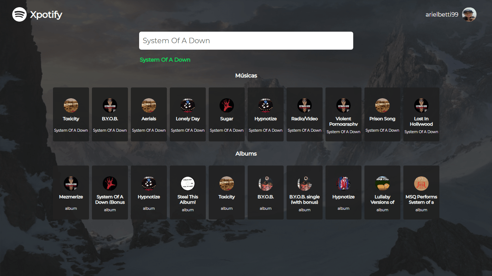
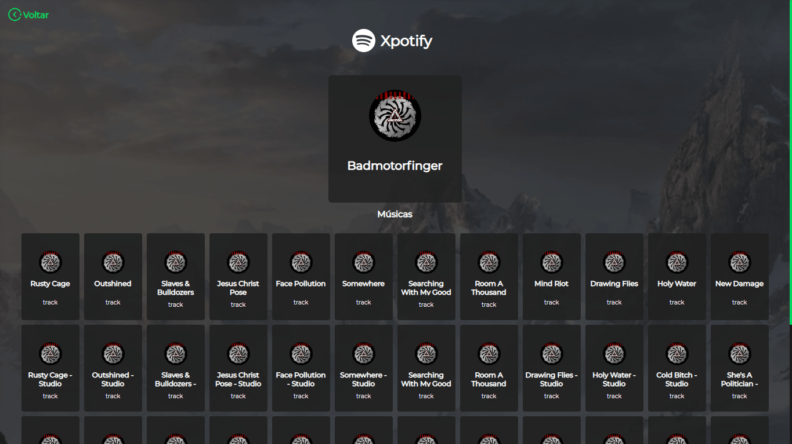

# Xpotify-React

> Aplicação com integração das API's do Spotify.

# Esse projeto já está em Deploy !
***Veja aqui:*** **https://xpotify-react.herokuapp.com/**


# Configurando localmente.

## Instalação

```sh
git clone https://github.com/ArielBetti/Xpotify-React
```
Dentro do projeto de um yarn install ou npm install

```sh
npm install
```

```sh
yarn install
```

## Como iniciar o projeto localmente

Configure as váriaveis de ambiente no diretorio **src/server/app.js** após configurar certifique-se que está em **src/server/app**
e execute um 

```sh
yarn app
```

ou

```sh
npm app
```


## Rode o React

Abra outra janela de terminal para executar o seguinte comando para iniciar o react, geralmente abre na porta **3000**.

```sh
yarn start
```

#### Veja o projeto no endereço http://localhost:3000





### Sobre

Criador: **Ariel Betti**<br>
Email: **ariel.betti@gmail.com**<br>

Distribuído sob a licença MIT. Veja `LICENSE` para mais informações.

## Como contribuir

1. Faça o _fork_ do projeto.
2. Crie uma _branch_ para sua modificação (`git checkout -b feature/fooBar`)
3. Faça o _commit_ (`git commit -am 'Add some fooBar'`)
4. _Push_ (`git push origin feature/fooBar`)
5. Crie um novo _Pull Request_
